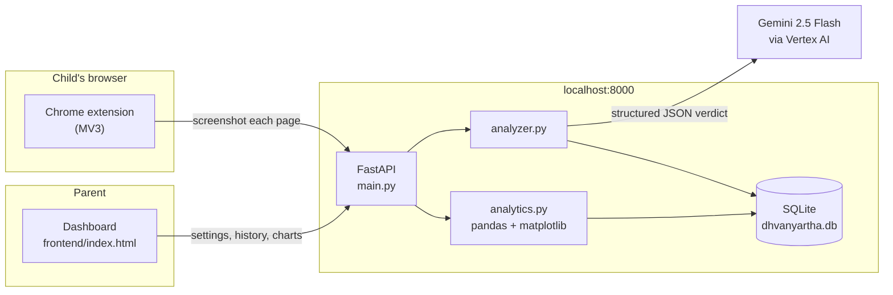

# Dhvanyartha

**Content moderation that reads what was *meant*, not just what was typed.**

Named for the Sanskrit poetic concept *dhvani* (suggested meaning) + *artha* (sense) — the idea, from Anandavardhana's *Dhvanyāloka*, that the meaning that matters is the one implied rather than stated. That is exactly the problem a keyword filter cannot solve, and exactly the problem this project takes on.

Dhvanyartha is a parental-control system for Indian households. It scans text, images, audio, video, and web pages, and decides what a child should see — while trying hard not to mistake a joke, a proverb, or a cry for help for something it isn't.

---

## Why this exists

Off-the-shelf content filters fail Indian families in specific, repeatable ways:

- **Code-mixed language.** Hinglish and Tanglish sentences shift script and language mid-clause. Word-list filters either miss everything or flag everything.
- **Cultural context.** A reference to a festival, a deity, a film, or a regional in-joke reads as noise — or as a threat — to a filter trained elsewhere.
- **Sarcasm and humour.** The literal text and the intended meaning routinely disagree.

Dhvanyartha sends content to Gemini with prompts built specifically around those failure modes, and asks for a structured judgement rather than a score.

### One design decision worth calling out

The system detects a `self_harm_signal` separately from its block/allow decision, and **a self-harm signal never blocks the page.**

If a child is searching for help, the page they've landed on may be the one showing helpline numbers. Blocking it would cut them off from exactly the thing they need. Instead the signal is surfaced to the parent's dashboard as something to follow up on, in person. The moderation decision and the welfare signal are deliberately kept on separate tracks.

---

## Architecture

Three parts, talking over HTTP:



| Path | Role |
|---|---|
| `backend/main.py` | FastAPI app — every HTTP endpoint |
| `backend/analyzer.py` | Gemini prompts, response parsing, scan persistence, chat routing |
| `backend/database.py` | SQLAlchemy models (`ScanRecord`, `ParentSettings`) over SQLite |
| `backend/analytics.py` | Reads scan history with pandas, renders PNG charts with matplotlib |
| `frontend/index.html` | Parent dashboard — settings, activity, analytics (single file, no build step) |
| `extension/` | Chrome MV3 extension — screenshots pages, enforces age and category rules |

**How enforcement actually works:** the extension screenshots each page as it loads, sends the image to `/analyze-image`, and receives a `min_age` plus a category list. It blocks if the child's configured age is below `min_age`, or if any returned category matches the parent's blocklist. Blocked URLs are remembered locally so a reload can't bypass the block while a fresh scan is still in flight.

---

## Setup

You need Python 3.10+ and Google Chrome. That's it — no Google Cloud account, no
`gcloud`, and no administrator rights.

### 1. Get a Gemini API key

Go to **https://aistudio.google.com/apikey** and create a key (free).

Copy `backend/.env.example` to `backend/.env` and paste the key in:

```
GEMINI_API_KEY=your-key-here
```

> Prefer Vertex AI? Set `GCP_PROJECT_ID` instead and run
> `gcloud auth application-default login`. The backend takes whichever it finds,
> checking the API key first.

> **On models:** scans use `gemini-flash-latest` by default, which tracks the
> current fast model. Pinned older names like `gemini-2.5-flash` are no longer
> served to new API keys and fail with a 404 on every scan. Override with
> `GEMINI_MODEL` in `.env` if you need a specific version.

### 2. Start it

From the project folder, double-click **`start.bat`** — or run:

```powershell
powershell -ExecutionPolicy Bypass -File start.ps1
```

That creates the virtual environment if needed, installs dependencies, starts the
backend on port 8000 and the dashboard on port 5500, waits until the backend
answers, and tells you whether Gemini is actually configured before opening the
dashboard.

To check the backend by hand at any time:

```bash
curl http://localhost:8000/health
```

<details>
<summary>Starting the two servers manually instead</summary>

```bash
# terminal 1 — must be run from inside backend/, because the imports are flat
# and the SQLite path is relative to the working directory
cd backend
../venv/Scripts/python -m uvicorn main:app --reload

# terminal 2
cd frontend
python -m http.server 5500
```
</details>

> **Port 5500 is not arbitrary.** The extension only links itself to the signed-in
> Google account when it sees the dashboard on that exact port (see
> `extension/content.js`). On any other port, extension scans will not show up
> under the right parent.

### 3. Install the extension in Chrome

1. Open `chrome://extensions`
2. Turn on **Developer mode** (top right)
3. Click **Load unpacked** and select the `extension/` folder
4. On the dashboard at `http://localhost:5500`, **sign in with Google** — this is
   what links the extension to your parent account

The extension is loaded unpacked rather than installed from the Chrome Web Store
because it talks to a backend on your own machine. It is built to protect one
household running its own server, not to be installed by strangers.

### Checking it works

Open any web page. A small capsule sits against the right edge of the screen
reading **Watching**. When a scan runs it sweeps and reads **Checking**, then
settles on the verdict — the coloured spine along its edge holds that verdict
until the next scan. Hover it to see the reason and to run a manual scan; drag it
anywhere and it snaps to the nearest edge and stays there.

The whole HUD lives in a Shadow DOM, so no page's CSS can restyle or hide it —
which matters most for the block overlay, since that must not be defeatable by the
page it is covering.

If nothing appears:

- Pages open **before** the extension loaded need a refresh — content scripts only
  inject on page load.
- If you previously dismissed the HUD with `×`, that is remembered across all
  pages. Turn **Show floating toolbar** back on in the extension popup.
- Chrome forbids content scripts on `chrome://` pages, the Chrome Web Store, PDFs,
  and other extensions' pages. Nothing can run there.

For anything else, open the service worker console from `chrome://extensions` —
every step logs with a `[Dhvanyartha Guard]` prefix.

---

## Tests

The offline suite covers message routing, the URL safety guard, and HTML text
extraction. It needs no network, no API key, and no GCP credentials — run it from
`backend/`:

```bash
python -m unittest discover tests -v
```

`pytest tests` works too if you prefer, but nothing extra needs installing.

---

## API

| Method | Endpoint | Purpose |
|---|---|---|
| `GET` | `/health` | Is the server up, and are Gemini credentials configured? |
| `POST` | `/analyze` | Moderate a block of text |
| `POST` | `/analyze-image` | Moderate an image (used by the extension for page screenshots) |
| `POST` | `/analyze-audio` | Transcribe and moderate audio |
| `POST` | `/analyze-video` | Describe and moderate video |
| `POST` | `/analyze-website` | Fetch a URL and moderate its text |
| `GET` | `/history` | Scan history, filterable by decision, source, and parent |
| `GET` / `POST` | `/settings` | Read or write a parent's age and category rules |
| `GET` | `/analytics/summary` | Headline counts (total / allowed / flagged / blocked) |
| `GET` | `/analytics/chart/{decisions,content-types,timeline}` | Rendered PNG charts |
| `POST` | `/chat` | Routes a message to history lookup, URL scan, or text scan |
| `POST` | `/chat-file` | Routes an uploaded file to the right analyzer by MIME type |

---

## Limitations

Worth being honest about, since this is a child-safety tool:

- **Local-first, no auth.** The backend trusts whatever `user_email` it is given and CORS is fully open. It is designed to run on `localhost`, not on a public host, and it is not multi-tenant safe as written. `/analyze-website` refuses to fetch loopback, private, and link-local addresses, but that guard is not a substitute for authentication.
- **A screenshot is not the page.** The extension moderates what is visible in the viewport, so content below the fold is only caught on a later scan pass.
- **Model judgement is not deterministic.** The same page can occasionally receive different verdicts, and prompt-based moderation can be wrong in both directions.
- **Sign-in is client-side only.** The Google credential is decoded in the browser and never verified server-side.

---

## Licence

No licence has been chosen yet — all rights reserved by default until one is added.
