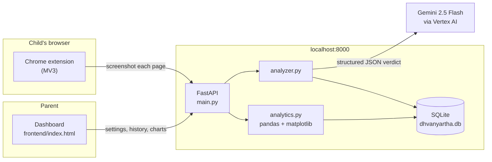

# Dhvanyartha

**Content moderation that reads what was *meant*, not just what was typed.**

Named for the Sanskrit poetic concept *dhvani* (suggested meaning) + *artha* (sense) — the idea, from Anandavardhana's *Dhvanyāloka*, that the meaning that matters is the one implied rather than stated. That is exactly the problem a keyword filter cannot solve, and exactly the problem this project takes on.

Dhvanyartha is a parental-control system for Indian households. It scans text, images, audio, video, and web pages, and decides what a child should see — while trying hard not to mistake a joke, a proverb, or a cry for help for something it isn't.

---

## Why this exists

Off-the-shelf content filters fail Indian families in specific, repeatable ways:

- **Code-mixed language.** Hinglish and Tanglish sentences shift script and language mid-clause. Word-list filters either miss everything or flag everything.
- **Cultural context.** A reference to a festival, a deity, a film, or a regional in-joke reads as noise — or as a threat — to a filter trained elsewhere.
- **Sarcasm and humour.** The literal text and the intended meaning routinely disagree.

Dhvanyartha sends content to Gemini with prompts built specifically around those failure modes, and asks for a structured judgement rather than a score.

### One design decision worth calling out

The system detects a `self_harm_signal` separately from its block/allow decision, and **a self-harm signal never blocks the page.**

If a child is searching for help, the page they've landed on may be the one showing helpline numbers. Blocking it would cut them off from exactly the thing they need. Instead the signal is surfaced to the parent's dashboard as something to follow up on, in person. The moderation decision and the welfare signal are deliberately kept on separate tracks.

---

## Architecture

Three parts, talking over HTTP:



| Path | Role |
|---|---|
| `backend/main.py` | FastAPI app — every HTTP endpoint |
| `backend/analyzer.py` | Gemini prompts, response parsing, scan persistence, chat routing |
| `backend/database.py` | SQLAlchemy models (`ScanRecord`, `ParentSettings`) over SQLite |
| `backend/analytics.py` | Reads scan history with pandas, renders PNG charts with matplotlib |
| `frontend/index.html` | Parent dashboard — settings, activity, analytics (single file, no build step) |
| `extension/` | Chrome MV3 extension — screenshots pages, enforces age and category rules |

**How enforcement actually works:** the extension screenshots each page as it loads, sends the image to `/analyze-image`, and receives a `min_age` plus a category list. It blocks if the child's configured age is below `min_age`, or if any returned category matches the parent's blocklist. Blocked URLs are remembered locally so a reload can't bypass the block while a fresh scan is still in flight.

---

## Setup

### Prerequisites

- Python 3.10+
- A Google Cloud project with the **Vertex AI API** enabled
- Google Chrome

### 1. Backend

```bash
cd backend
python -m venv venv
venv\Scripts\activate          # macOS/Linux: source venv/bin/activate
pip install -r requirements.txt
```

Authenticate to Google Cloud and point the app at your project:

```bash
gcloud auth application-default login
```

Create `backend/.env`:

```
GCP_PROJECT_ID=your-gcp-project-id
```

Then start the server **from inside `backend/`** — the module imports are flat and the SQLite path is relative, so the working directory matters:

```bash
uvicorn main:app --reload
```

The API comes up on `http://localhost:8000`. Interactive docs are at `http://localhost:8000/docs`.

### 2. Dashboard

Serve `frontend/` **on port 5500 specifically**:

```bash
cd frontend
python -m http.server 5500
```

> **Port 5500 is not arbitrary.** The extension only syncs the signed-in Google account into its own storage when it detects the dashboard at `localhost:5500` (see `extension/content.js`). On any other port, extension scans will not appear under the right parent in the dashboard.

### 3. Extension

1. Open `chrome://extensions`
2. Enable **Developer mode**
3. **Load unpacked** → select the `extension/` folder
4. Open the dashboard and sign in with Google — this links the extension to the parent account

---

## Tests

The offline suite covers message routing, the URL safety guard, and HTML text
extraction. It needs no network, no API key, and no GCP credentials — run it from
`backend/`:

```bash
python -m unittest discover tests -v
```

`pytest tests` works too if you prefer, but nothing extra needs installing.

---

## API

| Method | Endpoint | Purpose |
|---|---|---|
| `POST` | `/analyze` | Moderate a block of text |
| `POST` | `/analyze-image` | Moderate an image (used by the extension for page screenshots) |
| `POST` | `/analyze-audio` | Transcribe and moderate audio |
| `POST` | `/analyze-video` | Describe and moderate video |
| `POST` | `/analyze-website` | Fetch a URL and moderate its text |
| `GET` | `/history` | Scan history, filterable by decision, source, and parent |
| `GET` / `POST` | `/settings` | Read or write a parent's age and category rules |
| `GET` | `/analytics/summary` | Headline counts (total / allowed / flagged / blocked) |
| `GET` | `/analytics/chart/{decisions,content-types,timeline}` | Rendered PNG charts |
| `POST` | `/chat` | Routes a message to history lookup, URL scan, or text scan |
| `POST` | `/chat-file` | Routes an uploaded file to the right analyzer by MIME type |

---

## Limitations

Worth being honest about, since this is a child-safety tool:

- **Local-first, no auth.** The backend trusts whatever `user_email` it is given and CORS is fully open. It is designed to run on `localhost`, not on a public host, and it is not multi-tenant safe as written. `/analyze-website` refuses to fetch loopback, private, and link-local addresses, but that guard is not a substitute for authentication.
- **A screenshot is not the page.** The extension moderates what is visible in the viewport, so content below the fold is only caught on a later scan pass.
- **Model judgement is not deterministic.** The same page can occasionally receive different verdicts, and prompt-based moderation can be wrong in both directions.
- **Sign-in is client-side only.** The Google credential is decoded in the browser and never verified server-side.

---

## Licence

No licence has been chosen yet — all rights reserved by default until one is added.
